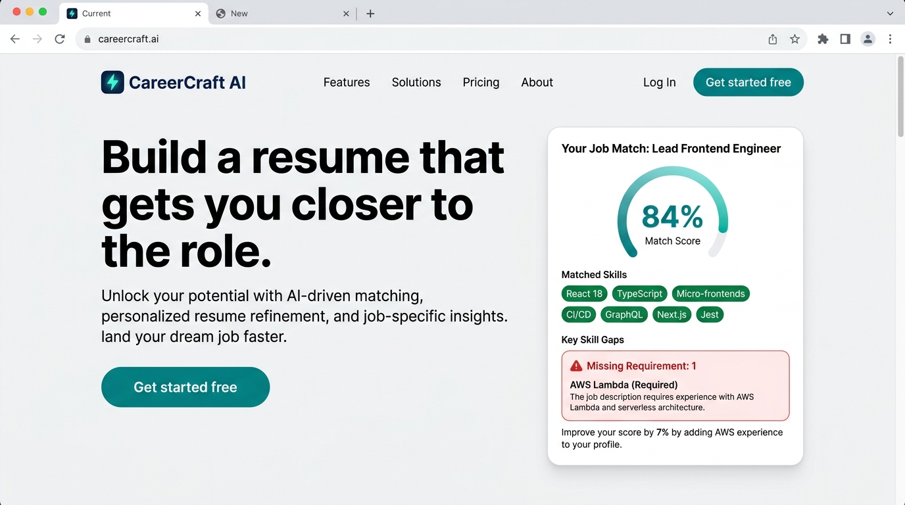
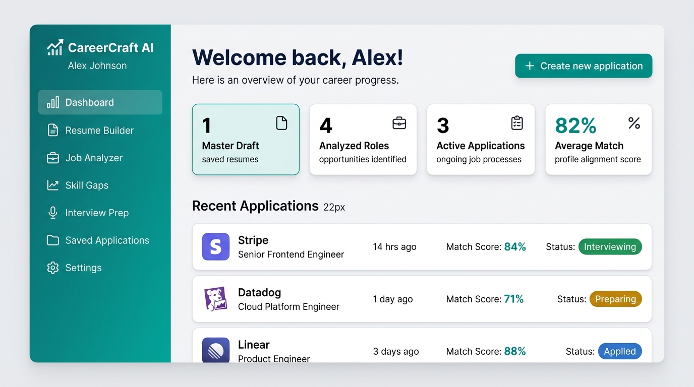
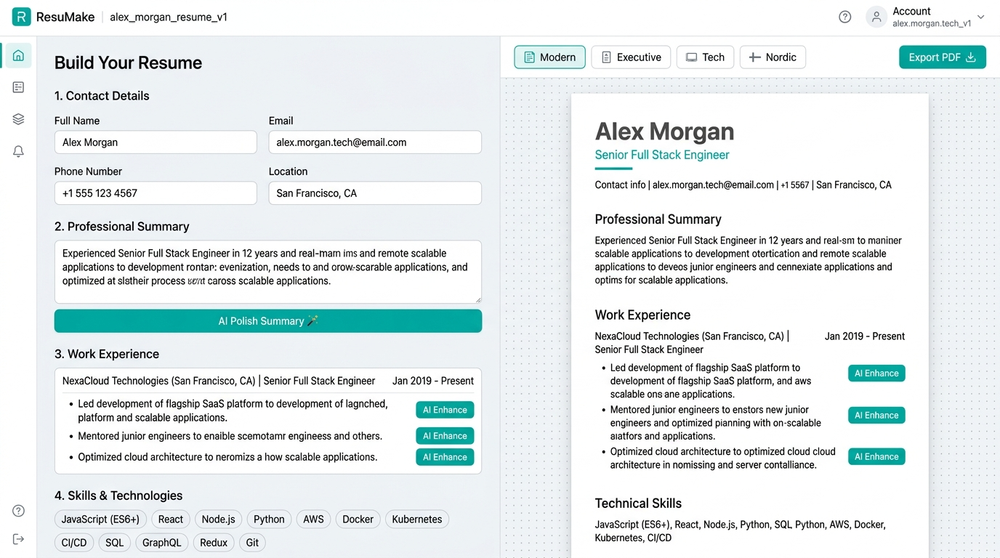
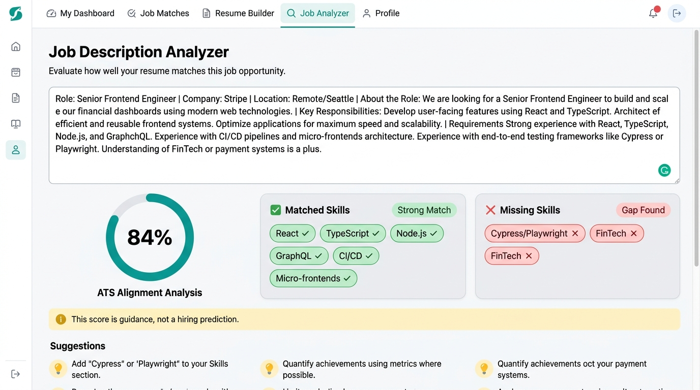
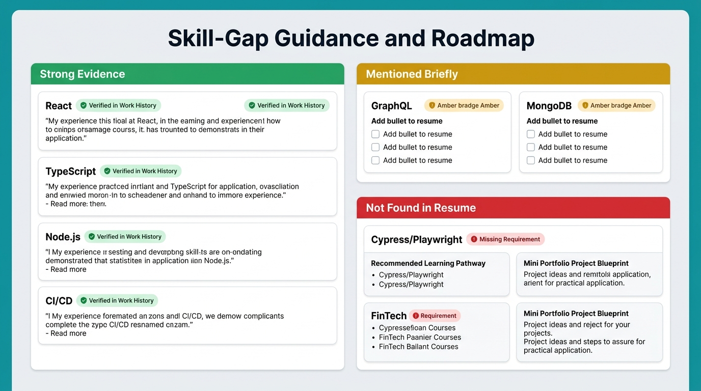
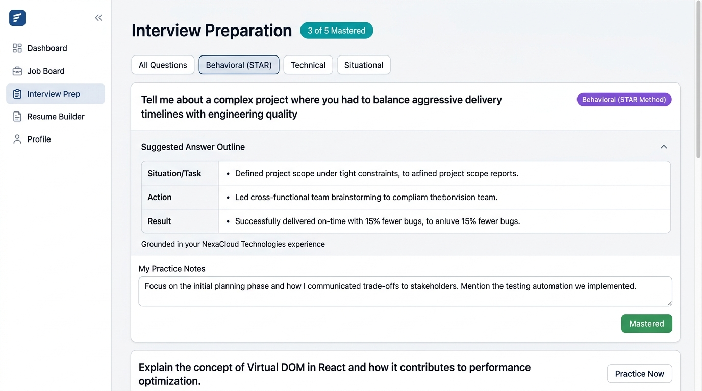

# CareerCraft AI — Intelligent Resume & Career Guidance Platform

> **Problem Statement:** Build an AI-powered platform that helps job seekers create tailored resumes, understand job descriptions, identify skill gaps, and prepare for interviews with intelligent guidance.



---

## 📋 Table of Contents

- [About the Project](#about-the-project)
- [Features](#features)
- [Screenshots & Results](#screenshots--results)
- [Technology Stack](#technology-stack)
- [Project Structure](#project-structure)
- [How to Run](#how-to-run)
- [Demo Walkthrough](#demo-walkthrough)
- [Architecture](#architecture)
- [Future Enhancements](#future-enhancements)

---

## 📖 About the Project

**CareerCraft AI** is a fully functional, responsive web application designed to help students, recent graduates, career changers, and experienced professionals navigate the job application process with confidence.

### Problem It Solves
- Job seekers struggle to tailor resumes to specific job descriptions
- Candidates often miss critical keywords that ATS (Applicant Tracking Systems) scan for
- Skill gaps between a candidate's profile and job requirements are hard to identify
- Interview preparation lacks structure and grounding in real experience

### Our Solution
CareerCraft AI provides an end-to-end career guidance pipeline:
1. **Resume Building** — Guided editor with AI-assisted STAR-format bullet enhancement and 4 ATS-friendly templates
2. **Job Description Analysis** — Paste any JD to get keyword matching, match scoring, and actionable improvement suggestions
3. **Skill Gap Diagnostics** — Skills categorized into Strong/Brief/Missing with learning pathways and project blueprints
4. **Interview Preparation** — Role-specific Behavioral, Technical, and Situational questions grounded in the user's real experience
5. **Application Tracking** — Save, manage, and revisit job applications with status tracking

### Target Users
- Students and recent graduates entering the job market
- Career changers transitioning to new fields
- Experienced professionals applying for senior roles
- Anyone seeking structured, honest career guidance

---

## ✨ Features

### 🏠 Landing Page
- Clear value proposition: *"Build a resume that gets you closer to the role"*
- Interactive preview card showing match score, verified skills, and gap detection
- Feature cards, 3-step "How It Works" section, and user testimonials
- Responsive design with primary and secondary CTAs

### 📊 Dashboard
- Personalized welcome banner with candidate name
- Summary metric cards: Saved Resumes, Analyzed Roles, Active Applications, Avg Match Score
- Recent applications list with company badges, match scores, and status indicators
- Quick action shortcuts to all major features
- Empty state UI for new users

### 📝 Resume Builder
- **Split-pane desktop layout**: Form editor (left) + live resume preview (right)
- **Guided form sections**: Contact Info, Professional Summary, Work Experience, Skills, Projects, Education, Certifications
- **AI-Assisted Enhancements**:
  - "AI Polish Summary" generates targeted 3-sentence executive summary
  - "AI Enhance" on individual bullets converts passive text to STAR-format action verbs with metrics
  - Diff modal shows original vs suggested text — fully editable before accepting
- **4 ATS-Friendly Templates**: Modern Minimalist, Executive Classic, Tech/Code, Nordic Clean
- **CRUD Operations**: Add, edit, reorder (↑↓), and delete experience/education/project entries
- **Skills Management**: Tag-based skill pills with add/remove
- **PDF Export**: Clean print stylesheet (`@media print`) renders ATS-ready documents
- **Sample Profile Switching**: Load pre-built profiles or start from blank canvas

### 🎯 Job Description Analyzer
- Large text area to paste any job description
- Optional Job Title and Company fields
- **1-Click Test Presets**: Stripe (Senior Frontend), Linear (Product Manager), Datadog (Cloud Platform)
- **Loading state** with animated spinner during analysis
- **Analysis Results**:
  - Animated circular gauge match score (50%–94% realistic range)
  - Matched skills with evidence level (Strong Match / Brief Mention) and source quotes
  - Missing skills clearly identified
  - Actionable resume improvement suggestions
  - Key responsibilities extracted from JD
- **Guidance disclaimer**: Score is directional ATS guidance, not a hiring prediction
- **Ethical safeguard**: Never recommends adding skills the user doesn't actually have

### 🧩 Skill-Gap Guidance
- Three color-coded groups:
  - 🟢 **Strong Evidence** — Verified in work history with concrete metrics
  - 🟡 **Mentioned Briefly** — Listed in skills but lacking quantified bullet points
  - 🔴 **Not Found in Resume** — Missing requirements with:
    - Recommended Learning Pathway (courses/resources)
    - Mini Portfolio Project Blueprint (hands-on project ideas)
    - Truthful Highlighting Advice
- Interactive checkboxes to mark recommendations as saved/completed
- Progress persisted via localStorage

### 🎙️ Interview Preparation
- **5 role-specific questions** generated from job description and candidate profile
- **Three categories**: Behavioral (STAR), Technical & Architecture, Situational & Problem Solving
- **Filter tabs** to view by category
- **Expandable answer outlines** with STAR framework (Situation → Task → Action → Result)
- **Grounding notes** showing which real project/experience each answer draws from
- **Practice scratchpad** for personal talking points (auto-saved)
- **Mastery tracker**: Mark questions as Mastered with live progress counter

### 💼 Saved Applications
- Application records with job title, company, match score, notes, and timestamps
- **Status pipeline**: Draft → Preparing → Applied → Interviewing → Archived
- Status dropdown selector with instant updates
- **Search & filter** by status pills or text query
- **Action buttons**: Review Match, Practice Questions, Tailor Resume, Delete (with confirmation)
- Empty state for new users with CTA

### ⚙️ Settings & Data Management
- Current user profile display
- Reset to Demo Data (with confirmation modal)
- Export full workspace backup as portable JSON file
- Demo mode active indicator

### 🔧 Quality & Accessibility
- All buttons and navigation items are fully functional
- Form validation and helpful error messages
- Loading states with animated spinners
- Confirmation modals for destructive actions (delete)
- Toast notifications for user feedback
- Keyboard accessible with visible focus states (`focus-visible` outlines)
- Semantic HTML headings and labeled form fields
- Responsive design: sidebar on desktop, mobile drawer navigation
- Data persisted between sessions via localStorage

---

## 📸 Screenshots & Results

### 1. Landing Page

*Hero section with headline, match score preview card, and CTAs*

### 2. Dashboard

*Welcome banner, metric cards, and recent applications list*

### 3. Resume Builder (Split-Pane)

*Left: guided form editor with AI Enhance buttons. Right: live ATS template preview*

### 4. Job Description Analyzer

*84% match score gauge, matched skills in green, missing skills in red, suggestions*

### 5. Skill-Gap Guidance

*Three groups: Strong Evidence (green), Mentioned Briefly (amber), Not Found (red) with learning pathways*

### 6. Interview Preparation

*STAR-method behavioral questions with expandable answer outlines and practice notes*

---

## 🛠️ Technology Stack

| Layer | Technology |
|-------|-----------|
| **Frontend** | HTML5, CSS3, JavaScript (ES6+) |
| **UI Framework** | Tailwind CSS (CDN) |
| **Typography** | Inter, JetBrains Mono, Merriweather (Google Fonts) |
| **State Management** | Custom reactive store with localStorage persistence |
| **Matching Engine** | Rule-based NLP with 30+ skill taxonomy and evidence grading |
| **Resume Templates** | 4 ATS-optimized renderers (Modern, Classic, Tech, Nordic) |
| **PDF Export** | Native browser print with dedicated `@media print` stylesheet |
| **Dev Server** | Python `http.server` (zero dependency) |
| **Deployment** | GitHub Pages / Vercel (zero-config) |

---

## 📁 Project Structure

```
CareerCraft-AI/
├── index.html              # Main SPA (Landing + 7 App Views + Modals)
├── css/
│   └── styles.css          # Custom animations, print styles, resume paper layout
├── js/
│   ├── data.js             # Sample profiles, job descriptions, testimonials
│   ├── store.js            # Reactive localStorage state management
│   ├── engine.js           # Skill taxonomy, matching engine, interview generator
│   ├── templates.js        # 4 ATS-friendly resume template renderers
│   └── app.js              # Main controller: navigation, events, view rendering
├── screenshots/            # Application screenshots for documentation
│   ├── 01_landing_page.jpg
│   ├── 02_dashboard.jpg
│   ├── 03_resume_builder.jpg
│   ├── 04_job_analyzer.jpg
│   ├── 05_skill_gaps.jpg
│   └── 06_interview_prep.jpg
├── server.py               # Python local development server
├── vercel.json             # Vercel deployment configuration
├── .gitignore              # Git ignore rules
└── README.md               # This documentation file
```

---

## 🚀 How to Run

### Prerequisites
- Any modern web browser (Chrome, Firefox, Edge, Safari)
- Python 3.x (for local server — optional)

### Method 1: Python Server (Recommended)
```bash
git clone https://github.com/nayudorimanohar-commits/CareerCraft-AI-Intelligent-Resume-Career-Guidance-Platform.git
cd CareerCraft-AI-Intelligent-Resume-Career-Guidance-Platform
python server.py
```
Open **http://localhost:8000** in your browser.

### Method 2: Direct File Open
Simply open `index.html` in any web browser. All features work without a server.

### Method 3: Live Deployment
Visit the GitHub Pages URL (after enabling Pages in repository settings):
**https://nayudorimanohar-commits.github.io/CareerCraft-AI-Intelligent-Resume-Career-Guidance-Platform/**

---

## 🎯 Demo Walkthrough

Complete this end-to-end flow to verify all features:

| Step | Action | Expected Result |
|:-----|:-------|:----------------|
| **1** | Click "Get started" on Landing Page | Dashboard loads with welcome banner and metrics |
| **2** | Click "Resume Builder" in sidebar | Split-pane editor opens with pre-loaded Alex Morgan profile |
| **3** | Click "✨ AI Enhance" on any experience bullet | Diff modal shows original vs STAR-enhanced version |
| **4** | Switch template to "Tech / Code" | Live preview instantly updates to monospace tech layout |
| **5** | Navigate to "Job Analyzer" | Analyzer page with text area and preset buttons |
| **6** | Click "Stripe (Senior Frontend)" preset | Job description auto-fills; click "Run Diagnostic Analysis" |
| **7** | Review results | 84% match score gauge, matched skills, gaps, suggestions |
| **8** | Click "View Skill Gaps" | Three categorized groups with learning blueprints |
| **9** | Check off a learning milestone | Checkbox persists across page refreshes |
| **10** | Navigate to "Interview Prep" | 5 role-specific questions with STAR outlines |
| **11** | Expand "Suggested Answer Outline" | Grounded answer using real NexaCloud/Pulse Dynamics data |
| **12** | Click "Mark as Mastered" | Progress counter updates (e.g., "1 of 5 Mastered") |
| **13** | Return to Analyzer, click "Save as Application" | Application saved to tracker |
| **14** | Navigate to "Saved Applications" | All applications listed with status dropdowns |
| **15** | Change status to "Applied" | Status badge updates; timestamp refreshes |
| **16** | Go to Resume Builder, click "📄 Export PDF" | Browser print dialog renders clean ATS resume |
| **17** | Navigate to "Settings" → "Export Backup" | JSON file downloads with all user data |

---

## 🏗️ Architecture

```
┌─────────────────────────────────────────────────────────────┐
│                        index.html                           │
│                   (Single Page Application)                 │
│                                                             │
│  ┌──────────┐  ┌──────────┐  ┌──────────┐  ┌──────────┐   │
│  │ Landing  │  │Dashboard │  │ Builder  │  │ Analyzer │   │
│  │   Page   │  │   View   │  │  (Split) │  │   View   │   │
│  └──────────┘  └──────────┘  └──────────┘  └──────────┘   │
│  ┌──────────┐  ┌──────────┐  ┌──────────┐  ┌──────────┐   │
│  │Skill Gaps│  │Interview │  │  Saved   │  │ Settings │   │
│  │Guidance  │  │   Prep   │  │  Apps    │  │  & Demo  │   │
│  └──────────┘  └──────────┘  └──────────┘  └──────────┘   │
└────────────────────────┬────────────────────────────────────┘
                         │
        ┌────────────────┼────────────────┐
        ▼                ▼                ▼
┌──────────────┐ ┌──────────────┐ ┌──────────────┐
│   store.js   │ │  engine.js   │ │ templates.js │
│              │ │              │ │              │
│ • localStorage│ │ • 30+ Skill │ │ • Modern     │
│ • Pub/Sub    │ │   Taxonomy   │ │ • Classic    │
│ • Profile    │ │ • Evidence   │ │ • Tech       │
│ • Apps CRUD  │ │   Grading    │ │ • Nordic     │
│ • Gap Track  │ │ • STAR Bullet│ │              │
│ • Interview  │ │   Enhancer   │ │ Resume       │
│   Notes      │ │ • Interview  │ │ Renderers    │
│              │ │   Generator  │ │              │
└──────────────┘ └──────────────┘ └──────────────┘
        │                │                │
        └────────────────┼────────────────┘
                         ▼
                 ┌──────────────┐
                 │   app.js     │
                 │              │
                 │ • Navigation │
                 │ • View Router│
                 │ • Event Binds│
                 │ • Diff Modal │
                 │ • Toast UI   │
                 │ • PDF Export │
                 └──────────────┘
```

### Key Design Decisions
1. **No Build Step Required**: Pure HTML/CSS/JS with Tailwind CDN — opens in any browser instantly
2. **Isolated Mock Engine**: All AI responses are generated by `engine.js` with clearly structured functions. To connect a real LLM API, replace `analyze()`, `aiEnhanceBullet()`, and `generateInterviewQuestions()` with `fetch()` calls
3. **Ethical AI Guardrails**: The system never recommends adding skills or achievements the user doesn't possess
4. **Client-Side Persistence**: All data stored in `localStorage` — no backend dependency, full privacy

---

## 🔮 Future Enhancements

- [ ] Connect to real LLM API (Gemini/OpenAI) for dynamic bullet enhancement and question generation
- [ ] Add user authentication with Firebase/Supabase
- [ ] Implement drag-and-drop resume section reordering
- [ ] Add resume file upload (PDF parsing with pdf.js)
- [ ] Multiple saved resume versions per job application
- [ ] Email notifications for application status reminders
- [ ] Dark mode theme toggle
- [ ] Collaborative resume review (share link with mentors)

---

## 👤 Author

**Nayudori Manohar**  
GitHub: [@nayudorimanohar-commits](https://github.com/nayudorimanohar-commits)

---

## 📄 License

This project is built for academic assessment purposes.
